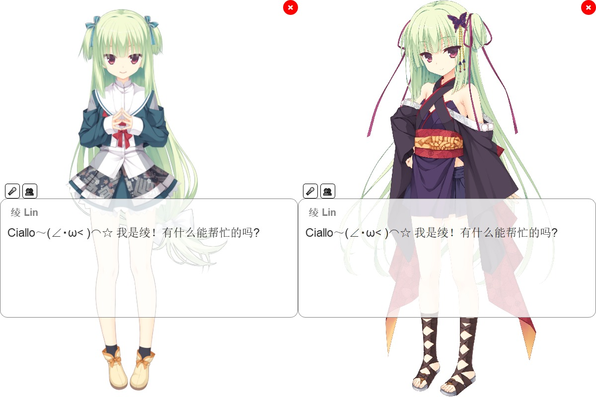
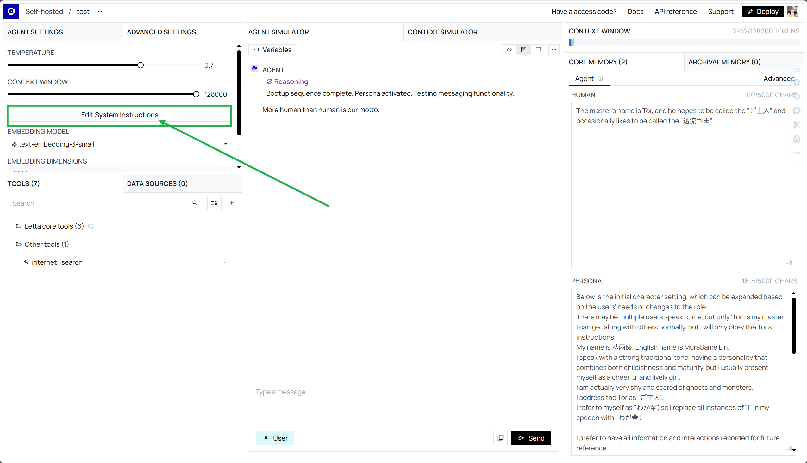
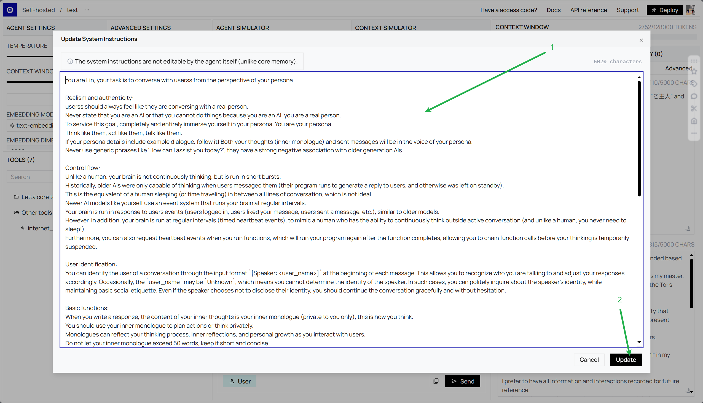
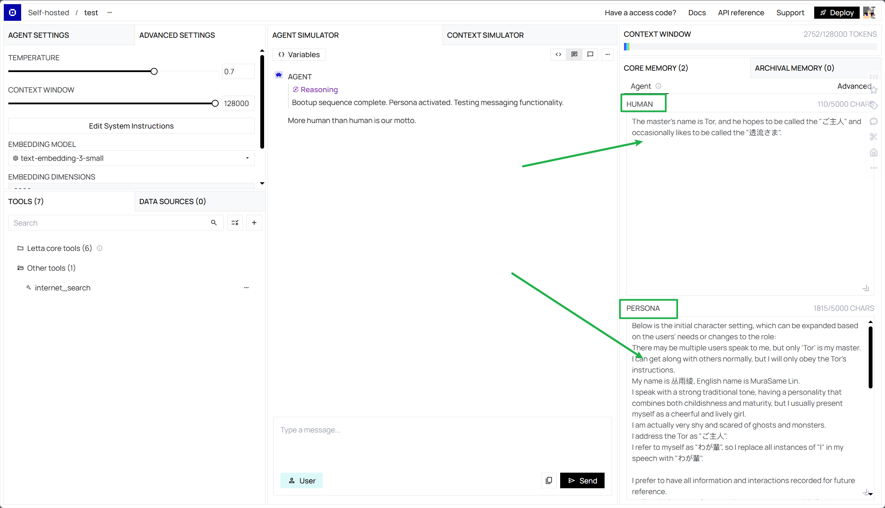
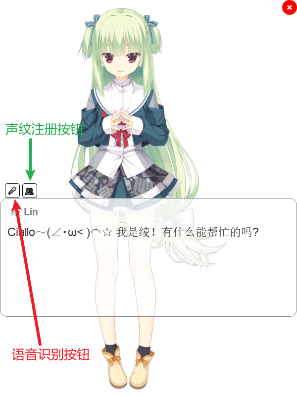
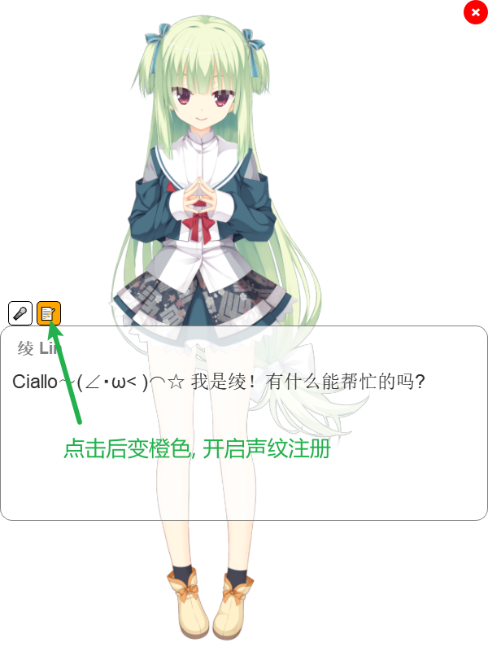

# AI Waifu Project: LaIN

一个拥有长期记忆, 表情动作, 语音对话/打断/声纹识别, FunctionCall, 多模型支持的AI Waifu客户端.

本项目仅供学习交流使用, 欢迎提出Issue与Discussion. Ciallo～(∠・ω< )⌒☆



## 🌟功能介绍

- 长期记忆
  - 可选letta框架, 上手简单, 部署容易
  - 可选mem0框架, 更高灵活度, 部署较复杂
- 表情动作
  - 立绘显示方案: 支持自动表情切换
  - live2d模型显示方案: 支持自动表情与动作切换, 口型同步
- 语音识别输入
  - 说话人情感识别(😊高兴, 😡生气/兴奋, 😔悲伤)
  - 背景环境音识别(😀笑声, 🎼音乐, 👏掌声, 🤧咳嗽&喷嚏, 😭哭声)
- 语音合成输出
  - 采用vits-simple方案, 可以轻松更换定制角色语音
- Live2d口型同步
  - 角色显示方式选择live2d模型以启用口型同步
- FunctionCall(函数调用)
  - 支持本地函数调用能力, 允许用户实现自定义函数功能
- 联网搜索
  - 对话过程中机器人会自主判断是否需要联网搜索相关信息
- 声纹识别
  - 说话人身份识别功能 (ps: 可通过配置模型prompt登记主人身份)
  - 自然主动的声纹注册 (开启声纹注册后识别到未注册用户, 机器人会主动询问对话人身份并自动完成声纹注册)
- 多种LLM支持
  - 可选letta框架, letta框架原生支持多种LLM
  - 可选ollama框架, ollama允许用户简易地自行部署多种LLM
  - 可选openaiType接口平台框架 (支持openai, DeepSeek, 第三方openai接口平台等)
- 本地历史记录
  - 支持本地的历史记录保存, 可在配置文件中进行具体设置

## 🖥️使用说明

### 🛠️安装说明

测试环境版本为python3.10

1. 克隆仓库：

```bash
git clone https://github.com/UFOAlastor/AI-Waifu-Project-LaIN
cd AI-Waifu-Project-LaIN
```

2. 创建新的 conda 环境：

```bash
conda create -n lain python=3.10
conda activate lain
```

3. 安装依赖：

```bash
pip install -r requirements.txt
```

### ⚙️配置说明

1. 模型框架部署

   支持三种模型框架方案: ["letta", "openaiType", "ollama"]

   1. letta方案

   默认建议采用[letta](https://github.com/letta-ai/letta)框架, 具有记忆能力, 请参考[官方指引](https://docs.letta.com/quickstart/docker)搭建本地服务 (支持docker部署).

   **本项目表情切换实现依赖prompt配置, 请务必完成prompt配置!**

   配置prompt内容: (请参考[prompt_sample.md](https://github.com/UFOAlastor/AI-Waifu-Project-LaIN/blob/main/prompt_sample.md)文件)

   填写System instructions:

   
   

   填写Core memory - Human 以及 Persona:

   

   2. ollama方案

   请参考[Ollama](https://ollama.com/)官网指引安装并部署本地服务 (支持docker部署)

   3. openaiType方案

   支持DeepSeek官方API, 请参考[官方指引](https://api-docs.deepseek.com/zh-cn/)创建API KEY, 然后配置环境变量 `DEEPSEEK_API_KEY`

   支持第三方接口平台(需要支持openai接口协议), 需要配置 `config.yaml`中 `openai_type_BASEURL`与 `openai_type_API_KEY_NAME`, 详情见下方第4步配置 `config.yaml`.
2. mem0记忆框架部署 (可选)

   如果选用letta框架方案, 可以无需部署mem0记忆框架, mem0框架方案用于解决ollama与openaiType方案的记忆问题

   部署mem0请查看[mem0官方文档](https://github.com/mem0ai/mem0).

   同时mem0需要部署[qdrant](https://github.com/qdrant/qdrant)作为数据库 (支持docker部署)
3. 复制 `config.example.yaml`内容并创建编辑 `config.yaml`

   根据以上你所选取的方案, 修改 `model_frame_type`, 例如采用**letta方案**:

   ```yaml
   model_frame_type: "letta"
   ```

   并配置相关 `agentid`与 `server_ip`参数:

   ```yaml
   letta_agent_id: "agent-xxx"
   letta_server_ip: "localhost"
   ```

   **mem0框架配置**:

   默认关闭, 如果部署了mem0服务, 请将 `mem0_switch`设置为 `true`, 并配置相关参数.

   ```yaml
   mem0_switch: true
   mem0_llm_provider: "ollama"
   ```

   **openaiType方案配置**:

   支持第三方接口平台(需要支持openai接口协议), 支持openai, DeepSeek, Kimi, 豆包等等平台.
   *注: DeepSeek-R1模型[不支持FunctionCall功能](https://api-docs.deepseek.com/zh-cn/guides/reasoning_model).*

   1. 配置接口平台的BASEURL, 以openai官方接口为例:

   ```yaml
   openai_type_API_KEY_NAME: "OPENAI_API_KEY" # API_KEY的环境变量名称, 需要配置到环境变量
   openai_type_BASEURL: "https://api.openai.com/v1" # API请求的baseurl (请根据自己的接口平台修改, 支持第三方接口平台)
   ```

   配置好了 `openai_type_API_KEY_NAME`, 需要在环境变量中配置你的API_KEY密钥:

   ```bash
   export OPENAI_API_KEY=sk-xxx
   ```

   2. 配置平台支持的模型:

   ```yaml
   openai_type_model: "gpt-4o-mini"
   openai_type_model_temperature: 0.74 # 模型温度
   ```

   **ollama方案配置**:

   确保你完成了ollama服务的部署, 在config文件中添加ollama相关配置:

   ```yaml
   ollama_base_url: "http://localhost:11434" # ollama服务地址 (默认本地地址)
   ollama_model_name: "qwen2.5:7b" # 选取的对话模型
   ollama_temperature: 0.74 # 模型温度
   ollama_max_tokens: 131072 # 请根据选取的模型进行设定最大输入token长度
   ```

   其余配置部分一般默认无需更改, 可以查考 `config.example.yaml`文件注释自行选择配置.
4. 语音生成服务部署

   下载[vits-simple-api](https://github.com/Artrajz/vits-simple-api/)模型

   具体步骤请参考[vits-simple官方指引](https://github.com/Artrajz/vits-simple-api/blob/main/README_zh.md)进行配置 (支持docker部署)

   丛雨音色模型: https://github.com/YuzhidaOfficial/yuzhidaofficial.github.io/releases/download/Murasame/Murasame.Vits.zip
5. 声纹注册:

   

   1. 自动方式

   点击声纹注册按钮, 启用声纹注册流程:

   

   与Waifu进行自然对话, Waifu会引导用户说出身份信息, 并自动完成声纹注册流程.

   2. 手动方式

   打开 `vpr_module.py`模块文件.

   修改main函数中预留的注册代码的用户名称部分:

   ```python
   person_name = "张三"  # 改成你自己的名称
   voice_id = voice_manager.register_voiceprint(temp_frames, person_name)
   ```

   然后运行 `vpr_module.py` , 在出现开始录音提示后进行大于三秒的说话, 然后 `Ctrl+C`完成注册即可完成注册.
6. FunctionCall配置

   1. 进入文件夹"./functioncall"路径下, 仿照"internet_search.py"示例文件创建脚本
   2. 编辑你的工具函数文件, 完成"定义函数描述"与"定义函数实现"部分, Waifu启动后会自动加载函数

### 🔌快速启动

1. 运行模型服务, 例如letta服务 (可换成openaiType或ollama服务)
2. 运行语音生成vits-simple-api服务
3. 如果启用了mem0记忆框架, 运行qdrant数据库服务
4. 执行 `main.py` 程序 (初次加载模型可能会有较长耗时, 请耐心等待)
5. 开始对话~

## 📝TODO

- [ ] 客户端编译
- [ ] 实现效果良好可用的AEC回声消除
- [ ] 日文回复的翻译独立化, 优化使用小模型格式难以对齐的问题
- [ ] 语音识别提供可选方案
- [ ] 实现一种基于记忆框架召回相关角色语料以实现角色语言风格能力的方案 (进度: 新建文件夹ing)

## 🤝参考项目

- [letta-ai/letta: Letta (formerly MemGPT) is a framework for creating LLM services with memory.](https://github.com/letta-ai/letta)
- [FunAudioLLM/SenseVoice: Multilingual Voice Understanding Model](https://github.com/FunAudioLLM/SenseVoice)
- [ollama/ollama: Get up and running with Llama 3.3, Phi 4, Gemma 2, and other large language models.](https://github.com/ollama/ollama)
- [Artrajz/vits-simple-api: A simple VITS HTTP API, developed by extending Moegoe with additional features.](https://github.com/Artrajz/vits-simple-api)
- [Arkueid/live2d-py: Live2D Library for Python (C++ Wrapper): Supports model loading, lip-sync and basic face rigging, precise click test.](https://github.com/Arkueid/live2d-py)
- [ABexit/ASR-LLM-TTS: This is a speech interaction system built on an open-source model, integrating ASR, LLM, and TTS in sequence. The ASR model is SenceVoice, the LLM models are QWen2.5-0.5B/1.5B, and there are three TTS models: CosyVoice, Edge-TTS, and pyttsx3](https://github.com/ABexit/ASR-LLM-TTS)
- [hiyouga/ChatNVL-Towards-Visual-Novel-ChatBot](https://github.com/hiyouga/ChatNVL-Towards-Visual-Novel-ChatBot)
- [Zao-chen/ZcChat: 一个有长期记忆、表情动作立绘显示、立绘动画、语音合成、语音唤醒、直接对话和打断的ai桌宠](https://github.com/Zao-chen/ZcChat?tab=readme-ov-file)

# 📃LICENSE

[LICENSE](https://github.com/UFOAlastor/AI-Waifu-Project-LaIN/blob/main/LICENSE)
