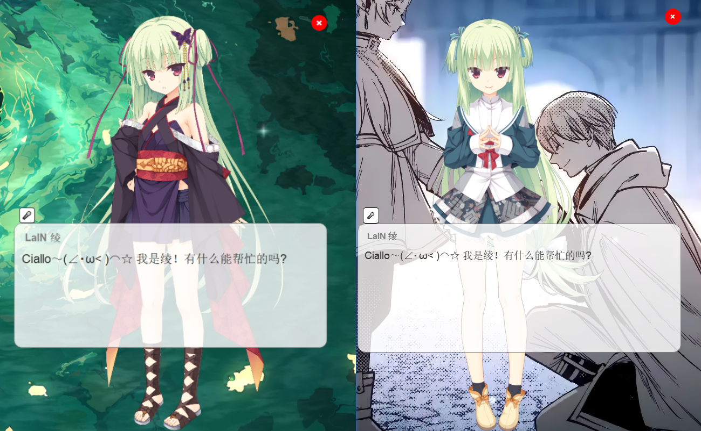

# AI Waifu Project: LaIN

一个拥有长期记忆, 表情动作, 语音对话/打断/声纹识别, FunctionCall, 多模型支持的AI Waifu客户端.

本项目仅供学习交流使用, 欢迎提出Issue与Discussion. Ciallo～(∠・ω< )⌒☆

## 🌟功能介绍

- 长期记忆
  - 可选letta框架, 上手简单, 部署容易
  - 可选mem0框架, 更高灵活度, 部署较复杂
- 表情动作
  - 立绘显示方案: 支持自动表情切换
  - live2d模型显示方案: 支持自动表情与动作切换, 口型同步
- 语音识别输入
  - 说话人情感识别(😊高兴, 😡生气/兴奋, 😔悲伤)
  - 背景环境音识别(😀笑声, 🎼音乐, 👏掌声, 🤧咳嗽&喷嚏, 😭哭声)
- 语音合成输出
  - 采用vits-simple方案, 可以轻松更换定制角色语音
- Live2d口型同步
  - 角色显示方式选择live2d模型以启用口型同步
- FunctionCall(函数调用)
  - 支持本地函数调用能力, 允许用户实现自定义函数功能
- 联网搜索
  - 对话过程中机器人会自主判断是否需要联网搜索相关信息
- 声纹识别
  - 说话人身份识别功能 (ps: 可通过配置模型prompt登记主人身份)
  - 自然主动的声纹注册 (识别到未注册用户, 机器人会主动询问对话人身份, 并自动完成声纹注册)
- 多种LLM支持
  - 可选letta框架, letta框架原生支持多种LLM
  - 可选ollama框架, ollama允许用户简易地自行部署多种LLM
  - 可选openaiType接口平台框架 (支持openai, DeepSeek, 第三方openai接口平台等)
- 本地历史记录
  - 支持本地的历史记录保存, 可在配置文件中进行具体设置

## 🖥️使用说明

注意: **本项目的表情切换依赖prompt配置实现, 请务必关注prompt示例内容!**

(prompt配置请参考prompt_sample.md文件)

1. 在仓库根目录下执行 `pip install -r requirements.txt`指令以安装依赖库
2. 执行仓库根目录下脚本 `setup.bat`安装所需的模型以及live2d-py等依赖
3. 查看config.yaml配置文件, 并根据注释说明进行自定义配置
4. 模型框架部署:
   1. 默认建议采用[letta](https://github.com/letta-ai/letta)框架, 具有记忆能力, 请参考官方指引搭建本地服务 (支持docker部署)
      1. letta的prompt配置请参考prompt_sample.md文件, 本项目表情切换功能依赖prompt实现.
   2. 支持[Ollama](https://ollama.com/), 请参考官网指引安装并部署本地服务 (支持docker部署)
   3. 支持DeepSeek官方API, 请参考[官方指引](https://api-docs.deepseek.com/zh-cn/)创建API KEY, 然后配置环境变量 `DEEPSEEK_API_KEY`
   4. 支持[mem0](https://github.com/mem0ai/mem0)记忆框架, 需要部署qdrant作为数据库, 建议采用docker部署
5. 语音生成服务:
   1. [vits-simple-api](https://github.com/Artrajz/vits-simple-api/blob/main/README_zh.md), 请参考vits-simple官方指引进行配置 (支持docker部署)
   2. 丛雨音色模型: https://github.com/YuzhidaOfficial/yuzhidaofficial.github.io/releases/download/Murasame/Murasame.Vits.zip
6. 声纹注册:
   1. 自动方式: 语音对话中识别到未注册用户, 机器人会主动询问对话人身份, 并自动完成声纹注册
   2. 手动方式: 修改main函数中预留的注册代码的用户名称部分, 然后运行 `vpr_module.py` 根据提示完成注册
7. FunctionCall:
   1. 进入文件夹"./functioncall"路径下, 观察"internet_search.py"示例文件
   2. 新建你的".py"格式函数文件, 仿照示例文件格式编写"定义函数描述"与"定义函数实现"即可, 主程序启动后会自动加载函数
8. 运行程序:
   1. 运行letta服务 (可换成openaiType或ollama服务)
   2. 运行vits-simple服务
   3. 运行qdrant服务 (如果启用了mem0记忆框架)
   4. 执行 `main.py`主程序 (初次加载模型可能会有较长耗时, 请耐心等待)
   5. 开始对话~

## 🤝参考项目

- [letta-ai/letta: Letta (formerly MemGPT) is a framework for creating LLM services with memory.](https://github.com/letta-ai/letta)
- [FunAudioLLM/SenseVoice: Multilingual Voice Understanding Model](https://github.com/FunAudioLLM/SenseVoice)
- [ollama/ollama: Get up and running with Llama 3.3, Phi 4, Gemma 2, and other large language models.](https://github.com/ollama/ollama)
- [Artrajz/vits-simple-api: A simple VITS HTTP API, developed by extending Moegoe with additional features.](https://github.com/Artrajz/vits-simple-api)
- [Arkueid/live2d-py: Live2D Library for Python (C++ Wrapper): Supports model loading, lip-sync and basic face rigging, precise click test.](https://github.com/Arkueid/live2d-py)
- [ABexit/ASR-LLM-TTS: This is a speech interaction system built on an open-source model, integrating ASR, LLM, and TTS in sequence. The ASR model is SenceVoice, the LLM models are QWen2.5-0.5B/1.5B, and there are three TTS models: CosyVoice, Edge-TTS, and pyttsx3](https://github.com/ABexit/ASR-LLM-TTS)
- [hiyouga/ChatNVL-Towards-Visual-Novel-ChatBot](https://github.com/hiyouga/ChatNVL-Towards-Visual-Novel-ChatBot)
- [Zao-chen/ZcChat: 一个有长期记忆、表情动作立绘显示、立绘动画、语音合成、语音唤醒、直接对话和打断的ai桌宠](https://github.com/Zao-chen/ZcChat?tab=readme-ov-file)

# 📃LICENSE

[LICENSE]()
